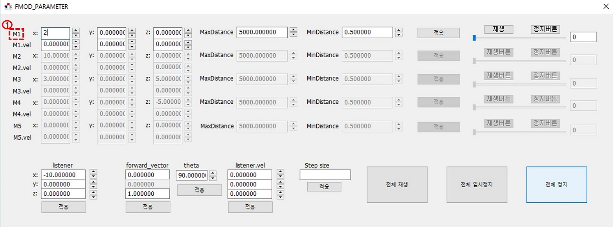
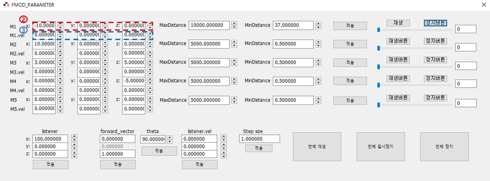
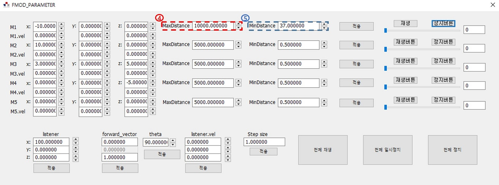
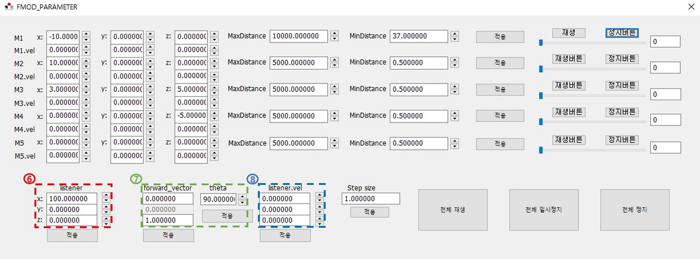
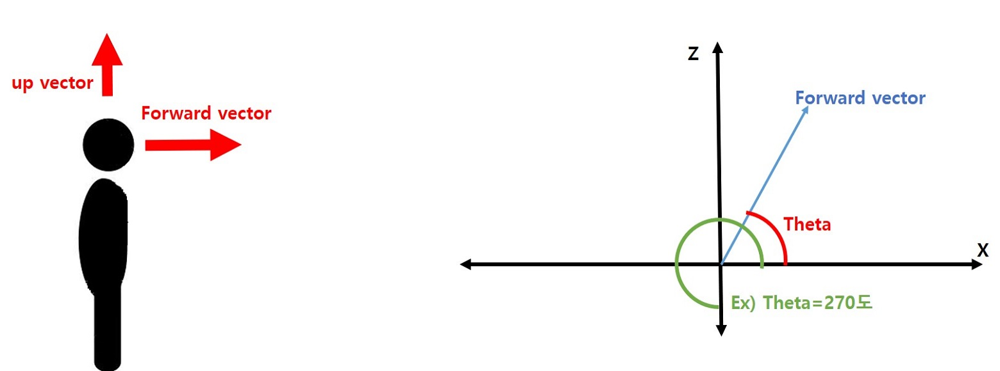
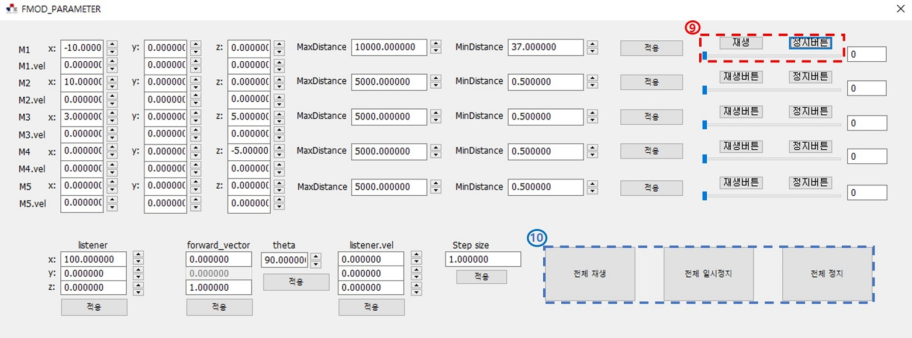
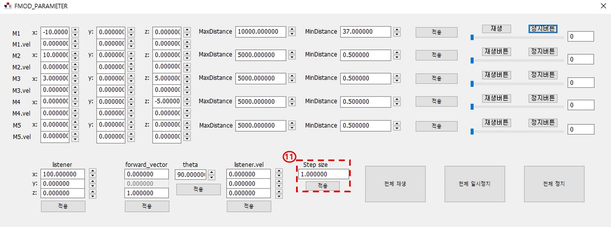
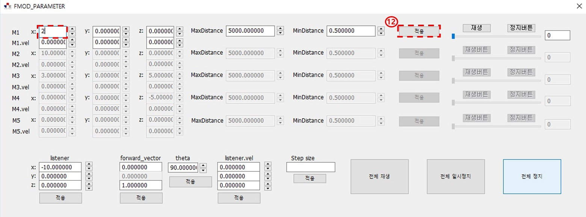
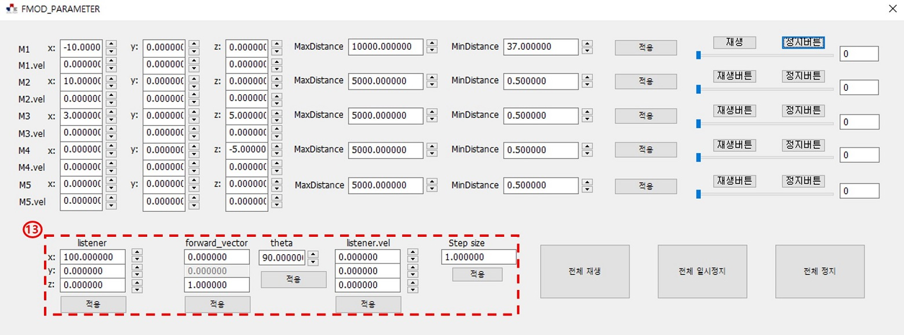
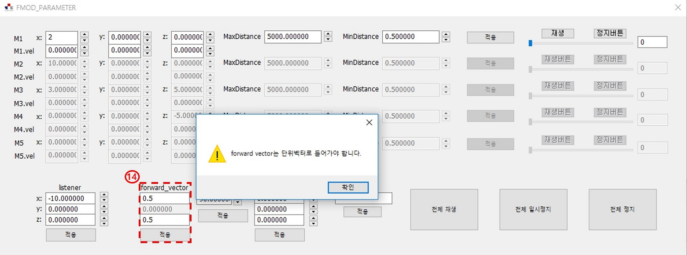

## Requirement

- MFC
- [FMOD](<https://www.fmod.com/>)

## How to use?

##### 1. 각 음원을 나타내는 명입니다. 음원은 총 5개 까지만 넣을 수 있게 구현되어 있습니다.

- 음원은 media 폴더에 있으며, wav 확장자가 가장 라이브러리에 적합하기 때문에 고정해두었습니다.

- 음원의 파일명도 1,2,3,4,5로 고정되어 있기 때문에 음원 명, 확장자가 일치 하지 않을 경우나 혹은 음원을 5개 미만으로 사용하기를 원하는 경우를 위해 자동으로 비활성화 됩니다.

  

##### 2.  음원의 위치 좌표 입니다.

##### 3.  음원의 velocity vector(distance units per second) 입니다. 속도감을 표현하기 위한 vector로 알아두시면 될 것 같습니다.

##### 4.  5.  Max, Min distance는 각각 소리가 어느 거리부터 줄고 어느 거리까지 줄어들지 정하는 파라미터 입니다. 리스너가 음원과 min distance 위치 사이에 있으면 최대 음량으로 들을 수 있습니다.

##### 5.  리스너(청취차)의 위치 좌표 입니다.

##### 6. 리스너의 forward vector 입니다.

##### 7.  리스너의 velocity vector 입니다.

- 리스너의 파라미터에는 위치 좌표, velocity vector 외에도 forward vector, up vector를 합하여 총 4가지의 vector 값이 존재 합니다.
- up vector와 forward vector는 각각 머리가 어느 방향을 향하는 가, 얼굴이 어느 방향으로 향하는 가를 나타내는 정보입니다. up vector와 forward vector는 항상 단위 벡터의 형태로 들어가야 하며 두 벡터의 관계는 항상 수직이어야 합니다.
- 이 예제에서는 up vector를 {1,0,1}로 고정하였고 forward vector만 다루게 하였습니다.
- Theta는 forward vector와 x축이 이루는 각도입니다.
- Theta의 default 값은 90도 입니다.

##### 9.  각 개별 음원에 대해서 재생, 일시정지, 정지 동작을 하는 버튼입니다.

##### 10.  전체 음원에 대해서 재생, 일시정지, 정지 동작을 하는 버튼입니다.

##### 11.   버튼은 해당 버튼의 왼쪽에 위치한 값을 변경 합니다. 변경되는 값은 Step size만큼 증가하거나 감소 됩니다.

##### 12.  해당 음원의 좌표 , velocity vector, Max distance, Min distance를 수기로 적용 하고 싶은 경우 해당 칸에 수기로 값을 입력 후 적용 버튼을 누르면 됩니다. 적용 버튼을 누르기 전에는 값이 적용되지 않습니다.

##### 13.  마찬가지로 리스너의 값을 수기로 적용 하고 싶으실 경우 해당 칸에 수기로 값을 입력하신 후 해당 값의 적용 버튼을 누르시면 됩니다. theta값이 이나 적용 버튼으로 변경될 시 forward vector도 자동으로 변경됩니다.

##### 14. Forward vector도 수기로 값을 조절할 수 있습니다. 다만 단위 벡터가 아닐 시 위와 같은 경고가 뜨고, 해당값은 반영되지 않습니다.

##### 15.  음원의 현재 재생되는 위치를 나타냅니다. 드래그하여 재생 위치를 조절 할 수 있습니다.

##### 16.  음원의 현재 재생되는 위치를 나타냅니다. 단위는 MS이며 수기로 입력하여 조절이 가능 하지만 해당 음원을 일시정지 혹은 정지버튼을 누르고 변경하셔야 합니다.

## Reference

- Sound 1,4 : [http://www.grsites.com/archive/sounds/](<http://www.grsites.com/archive/sounds/>)    
- Sound 2,3 : [https://www.fmod.com/](<https://www.fmod.com/>)