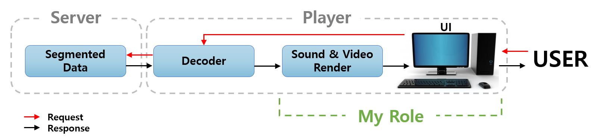

### [Portfolio_file](https://github.com/Songminkee/Portfolio/blob/master/Portfolio.pdf)

## Object

- 시청자의 조작에 맞춰 음향과 영상을 제공하는 대화형 컨텐츠 제공  

  

## My role

- 디코딩 된 음향 및 영상 데이터 랜더링 (Fmod, Opengl)
- Player UI 제공 (MFC)
- [음향 + 영상 랜더링 연동 데모](https://drive.google.com/file/d/1aVbnPVS1kR7Zw5ao3tgNl4w2fUY9GVGG/view?usp=sharing) (최종 결과물은 타기관의 프로그램이 포함되어 있어 공개하지 않았습니다.)  

  

## Related Demo Program

- [MFC_FMOD](https://github.com/Songminkee/Portfolio/tree/master/MFC_FMOD)

- [View Synthesis](https://github.com/Songminkee/Portfolio/tree/master/Virtual_View_Demo)

